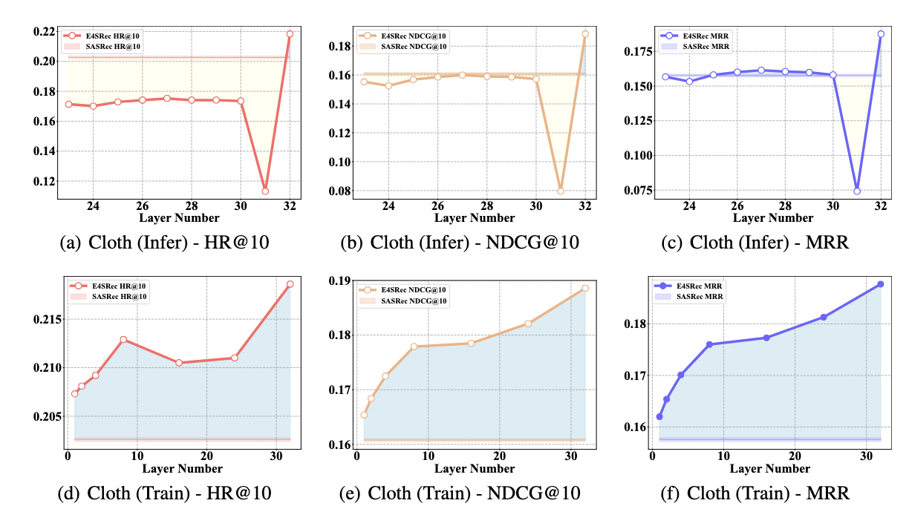
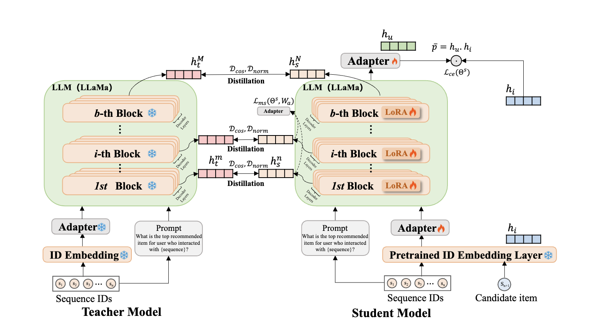

# SLMRec
The code for paper "SLMRec: Empowering Small Language Models for Sequential Recommendation".


# SLMRec: Empowering Small Language Models for Sequential Recommendation
This repo presents the implementation of the **SLMRec** 

We present **Empowering Small Language Models for Sequential Recommendation**, abbreviated as **SLMRec**. This paper presents an initial attempt to reassess the need for LLMs in sequential recommendation.

## Key Features of SLMRec🔑

- **Motivational Experiments**: To explore the reasons for the significant improvement of LLMRec methods, we conduct a series of experiments on large-scale industry datasets to investigate the effects of reducing the number of parameters during the training and inference stages on overall performance. From the empirical results, we found some profound insights that the improvement of the rise of the model parameters is not consistent. Meanwhile, it reveals that some layers of LLMs are redundant in the recommendation task.

<div align=center></div>

- **Simple but Effective Method**: Motivated by these findings, we empower small language models for the sequential recommendation, named SLMRec. We adopt the vanilla knowledge distillation approaches to align the representation knowledge. Moreover, multiple supervision signals are crafted to steer the student model toward acquiring task-aware knowledge within its hidden representations. Extensive experiments have shown that SLMRec, with a model size under 1 billion parameters, not only achieves performance comparable to baselines using LLMs with over 7 billion parameters but also delivers up to 6.6x faster training and 8.0x faster inference compared to LLM-based recommendation models.


<div align=center></div>

## Requirements

```
pip install -r requirements.txt
```

## Usage🧰

  
### Dataset🧑‍💻
1. Download [prepared dataset](https://drive.google.com/drive/folders/1cambs_D6OpiWJE8ms5pdxcmoVfiOOlKg?usp=sharing).

### Process by your own

1. Download [raw data](https://cseweb.ucsd.edu/~jmcauley/datasets/amazon_v2/).

2. Run the datasets/process.ipynb

### Training Processes
1. Train SR model to obtain the pretrained embedding layer.
```
python train_sr_trad.py
```

2. Save weights of embedding layer into local pkl file.
```
python extract_emb.py
```

3. Train a teacher model.
```
python finetune.py
```

4. Train a student model via the knowledge distillation.
```
python distill.py
```

### Hyperparameters

Please refer to the appendix in our paper.